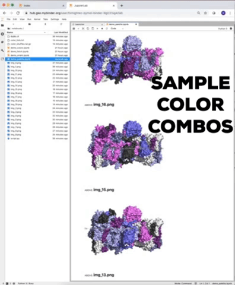

# pymol-binder
PyMOL able to be run via MyBinder.org.

Click a 'launch binder' badge on this page to begin an active session where PyMOL and the necessary dependencies are set to run.

This repo is meant to allow running PyMOL without the typical graphical user interface (GUI) of the desktop application, instead running headless using the command line/scripting. While this doesn't allow the interactive exploration common in PyMOL desktop use, many other interactions can still be performed without the GUI, such as extracting details from molecular structure files or rendering single static images or multiple image frames to compose into a movie or animation.

The notebooks available in the launched session demonstrate how to do things.  
You can use those examples as a guide to then analyze and make images or movies/animations of molecules of interest to you.

Resources
---------

- [PyMOL Wiki](https://pymolwiki.org/index.php/Main_Page)

- [List of the PyMOL API commands](https://pymol.org/dokuwiki/doku.php?id=api:cmd:alpha) (Note that this doesn't seem to include the the utilities library's commands, such as [Util.cbc()](https://pymolwiki.org/index.php/CBC), and in fact I could only find [these related mentions](https://pymol.org/dokuwiki/doku.php?do=search&id=util) among the PyMOL documentation.)

- [PyMOL Command Reference](https://pymol.org/pymol-command-ref.html) lists of all PyMOL commands which can be used in the PyMOL command line and in PML scripts.; it features several of the  utilities library's commands, such as `util.cbc` that wasn't listed in the API commands.

- [Online Supplemental content "An Introduction to Biomolecular Graphics" published in PLoS Comput Biol (2010)](https://pymolwiki.org/index.php/PLoS) that includes code for generating several images.

- [PyMOL tutorial from Nicholas Fitzkee's Structural Biology Bootcamp 2019](http://folding.chemistry.msstate.edu/files/bootcamp/2019/session-08_pymol-tutorial.pdf), plus see the entire [set of materials for session 8 that features molecular visualization with PyMOL](http://fitzkee.chemistry.msstate.edu/node/250).

- [A tutorial for PyMOL](http://www.pitt.edu/~epolinko/IntroPyMOL.pdf) - uses the standard graphical user interface. And so you might use that to see how some things are done and try performing the steps via scripts here.

- [A 2009 PyMOL Quick reference guide](https://www.feinberg.northwestern.edu/sites/csgid/docs/pymol_quick_reference.pdf) that includes 'Creating Low Resolution Surfaces of Large Systems', which looks related to the [Huge surfaces](https://pymolwiki.org/index.php/Huge_surfaces) page at the PyMOL wikie, yet presents different choices in the settings.

- [My structurework repo](https://github.com/fomightez/structurework) - includes PyMOL-related utilities by myself and others.

Why do I need this?
-------------------

**Example Uses**

Sampling different ways to apply a color palette to chains is more easily done with scripts. This allows you to consider your options for applying colors to chains.

Alternatives
------------

**Looking for something easier than even typical desktop PyMOL? Don't want to use code to generate fancy structure images and animations/movies?**  
Then check out [POLYVIEW-3D server](http://polyview.cchmc.org/polyview3d.html). Using that webtool you an fill out forms and check toggle boxes to choose options and settings and then have the server render your image or animation using PyMOL behind-the-scenes.

Technical note
--------------

The necessary packages to make PyMOL useable via the MyBinder.org system was worked out by [Dominique Sydow](https://github.com/dominiquesydow), see the repo [here](https://github.com/dominiquesydow/pymolmeetsbinder).

